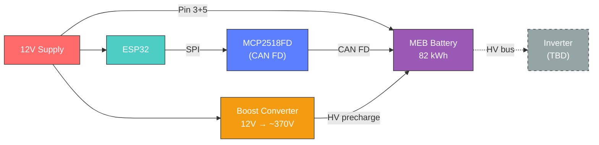

# MEB Battery Solar Storage

Second-life integration of Volkswagen MEB battery packs (ID.3/ID.4/ID.5/ID.Buzz) for solar/home energy storage.

Inspired by [Battery-Emulator](https://github.com/dalathegreat/Battery-Emulator/) by dala.

## Why MEB?

- 82 kWh usable capacity from a single pack
- 96S NMC chemistry, ~370V nominal
- Well-documented CAN FD protocol (thanks to the Battery-Emulator community)
- Standard 2.54mm dupont connector for data/LV — no proprietary harness needed
- Quirks (external pre-charge, CAN FD requirement) deter casual buyers — making packs cheaper on the secondhand market

Most EV batteries have internal pre-charge resistors — you apply 12V, send the right CAN messages, and contactors close. MEB packs don't. They require actual pack-level voltage (~370V) on the HV terminals before the BMS will engage. This likely scares off some of the secondhand market, but it's a solvable problem with a boost converter and the right control logic.

## System Architecture



## Table of Contents

### Research
- [Slot C Connector](docs/research/slot-c-connector.md) — Data/LV connector (2x11 dupont)
- [Pre-charge Requirement](docs/research/precharge-requirement.md) — Contactor enable conditions
- [MCP2518FD](docs/research/mcp2518fd.md) — SPI to CAN FD controller
- [MEB CAN Protocol](docs/research/meb-can-protocol.md) — Full protocol reference (IDs, timing, CRC, startup sequence)
- [HV Boost Converter](docs/research/hv-boost-converter.md) — Pre-charge voltage source (digitally controlled)

### Hardware
- [System Overview](docs/hardware/system-overview.md) — Mermaid wiring diagram with colour-coded subsystems

### Design
- [Design Decisions](docs/design/design-decisions.md) — Key choices and rationale

### Firmware
_(coming soon)_

## Hardware Stack

| Component | Role |
|-----------|------|
| ESP32-DevKitC V1 | Main controller (runs Battery-Emulator) |
| MCP2518FD breakout | CAN FD interface to battery (SPI, onboard transceiver) |
| SN65HVD230 | Classic CAN for future inverter |
| DC-DC boost converter | Pre-charge HV bus to ~370V |
| X9C503S digital pot | Digitally controls boost converter output voltage |
| 12V bench supply | Powers BMS, ESP32, boost converter |

## Project Structure

```
docs/
├── hardware/    # Wiring diagrams, component specs, pinouts
├── research/    # Notes on MEB CAN protocol, BMS behavior
└── design/      # System architecture, design decisions
firmware/        # Embedded code
tools/           # Helper scripts (CAN log parsers, etc.)
```

## Status

🚧 **Research & planning complete** — waiting on hardware delivery.

- [x] MEB CAN FD protocol fully documented (IDs, timing, CRC, contactor sequence)
- [x] Slot C pinout mapped
- [x] Pre-charge requirement understood (external HV source needed)
- [x] Hardware selected and ordered
- [x] Wiring diagram created
- [ ] Flash Battery-Emulator onto ESP32
- [ ] First power-on with battery
- [ ] Contactor close achieved
- [ ] Inverter integration
