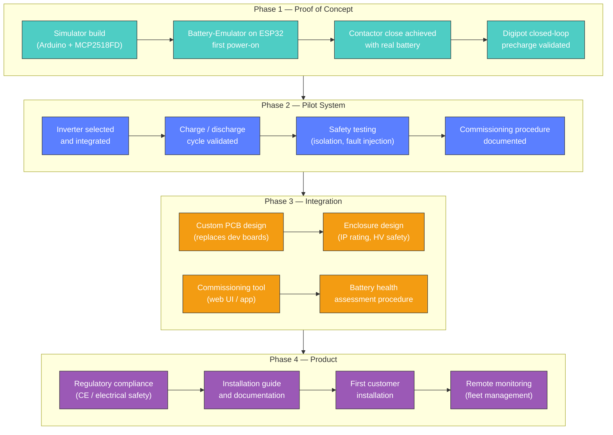

# Product Roadmap

From proof-of-concept to a commercially installable second-life MEB battery storage solution.

## Phase Summary

### Phase 1 — Proof of Concept
Validate the core technology: CAN FD communication, precharge sequence, and contactor control with a real MEB battery. All work done with dev boards and bench equipment.

### Phase 2 — Pilot System
Integrate an inverter and validate a full charge/discharge cycle. Develop safety testing procedures and a commissioning checklist. This phase produces the first working home storage system.

### Phase 3 — Integration
Replace dev boards with a custom PCB. Design an enclosure suitable for real-world installation. Build a commissioning tool for field use and a battery health assessment procedure for evaluating secondhand packs before purchase.

### Phase 4 — Product
Achieve regulatory compliance, produce installation documentation, and deliver the first customer installation. Add remote monitoring for fleet management as the install base grows.

## Current Status

We are in **Phase 1**, with hardware on order and the CAN FD protocol fully documented.
