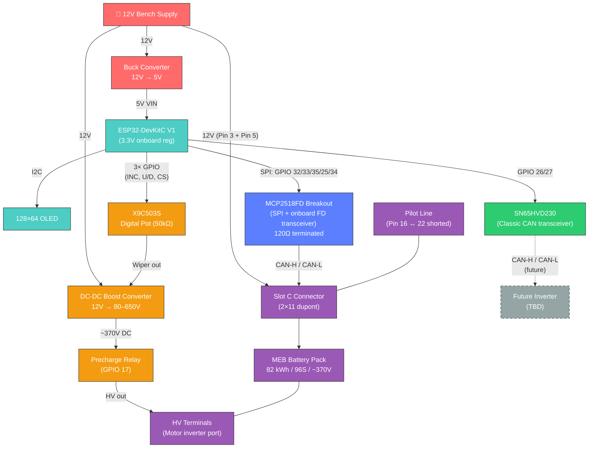
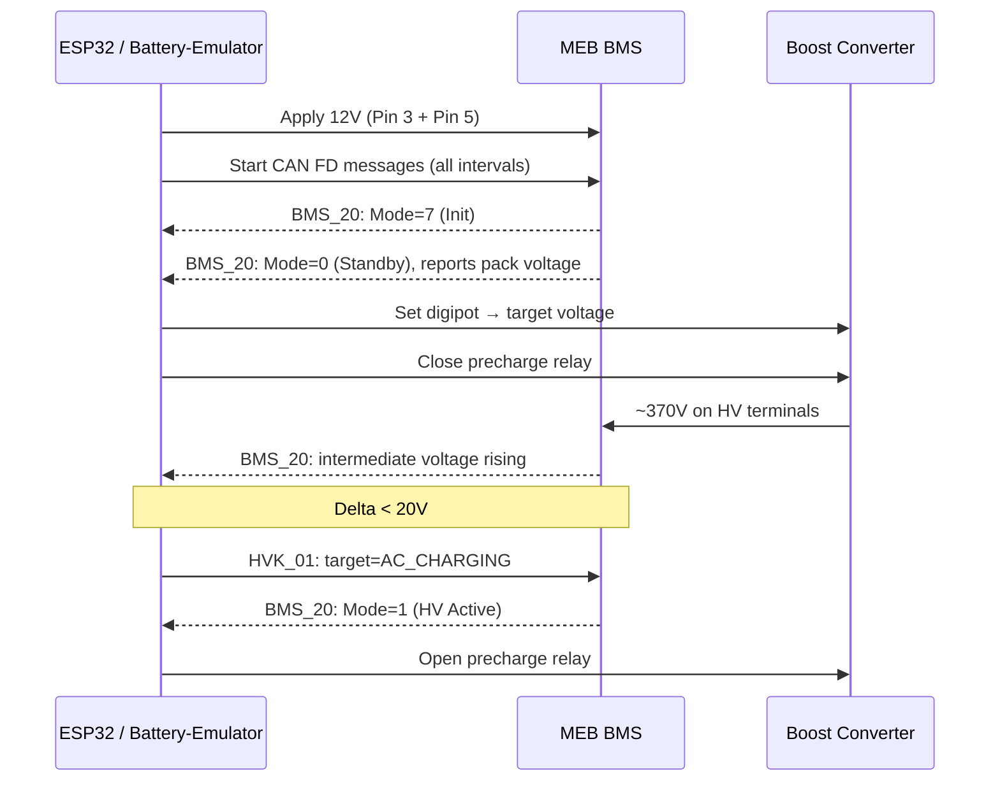

# System Overview

## Colour Key

| Colour | Subsystem |
|--------|-----------|
| 🔴 Red | Power supply |
| 🟢 Teal | Controller (ESP32, display) |
| 🔵 Blue | CAN FD (battery comms) |
| 🟢 Green | Classic CAN (future inverter) |
| 🟠 Orange | Pre-charge HV control |
| 🟣 Purple | Battery / BMS |
| ⚪ Grey dashed | Future / TBD |

## DSO Test Points

| Point | Signal | Where to probe |
|-------|--------|----------------|
| TP1 | CAN-H / CAN-L (FD) | Between MCP2518FD H/L and Slot C pins 17/11 |
| TP2 | SPI bus | GPIO 32 (MOSI), 35 (MISO), 33 (SCK) |
| TP3 | HV bus | Boost converter output / relay output |
| TP4 | Classic CAN | SN65HVD230 H/L (when inverter connected) |

## Startup & Contactor Close Sequence

